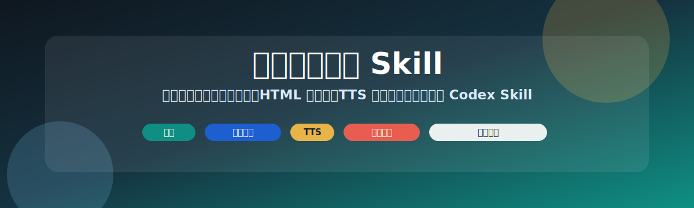

# 英语学习教练 Skill

[English README](README.md)

英语学习教练是一个面向英语学习的自适应 Codex Skill。它会根据学习者年龄、目标、当前水平、可用时间和输入材料，自动选择合适的练习模式，生成任务、反馈和学习记录。

它适合幼儿启蒙、小学生练习、中学英语提分、大学英语、雅思、托福、职场英语、自学材料处理、口语陪练、写作批改、阅读、听力、词汇、角色扮演、阶段计划和 HTML 练习页面生成。

## 核心价值

这个 Skill 可以把一个宽泛的英语学习需求，转成一次明确、可执行、可复盘的练习。

它可以：

1. 通过简短问诊识别学习者画像。
2. 为儿童、学生、备考者、职场学习者和自学者选择不同训练路径。
3. 把用户提供的文章、字幕、作文、邮件、题目或单词表转成练习任务。
4. 生成直观的 HTML 学习页面。
5. 在合适场景加入浏览器朗读或生成音频。
6. 提供聚焦纠错和模拟评分。
7. 输出学习记录，并询问是否保存学习进度。

## 安装方式

把本文件夹复制到 Codex skills 目录：

```text
~/.codex/skills/english-learning-coach
```

目录结构应为：

```text
english-learning-coach/
  SKILL.md
  README.md
  README.zh-CN.md
  agents/
    openai.yaml
  assets/
    readme-banner.svg
    readme-banner-cn.svg
```

安装后重启 Codex，让工具重新识别 Skill。

调用示例：

```text
Use $english-learning-coach to assess my English goal and start a focused practice session.
```

## 必需依赖

基础版没有额外运行依赖，只需要支持 Codex Skills 或类似 Skill 机制的 Agent 工具。

以下能力无需额外安装：

1. 学习者问诊。
2. 英语练习生成。
3. 材料处理。
4. 角色扮演。
5. 写作和口语反馈。
6. 模拟评分。
7. 阶段学习计划。
8. 学习记录。

## 可选 TTS 依赖

TTS 是可选能力。使用前，Skill 应该先询问用户是否需要安装或配置。

推荐提示：

```text
需要为本次英语练习安装或配置 TTS 吗？
1. 不需要，使用浏览器内置朗读
2. 需要，帮我安装 edge-tts 生成 mp3
3. 需要，帮我配置 Azure AI Speech
4. 需要，帮我配置 Amazon Polly
```

### 浏览器内置朗读

大多数 HTML 练习页优先使用这个方案，尤其适合儿童练习和短时互动练习。

无需安装。

使用注意：

1. 建议用 Microsoft Edge 打开 HTML 页面，发声最稳定。
2. Chrome 或其他浏览器在部分系统上可能缺少 voice，或者无法发声。
3. 页面应使用点击式朗读按钮，避免自动播放。

适合：

1. 单词卡片。
2. 句型练习。
3. 动态生成的示范回答。
4. 小测验题目。
5. 短口语练习。

### edge-tts

只有在用户需要固定 mp3 音频素材、离线音频包或固定课程音频时，才建议使用 edge-tts。

依赖：

1. Python。
2. `edge-tts` 包。

安装命令：

```bash
python -m pip install edge-tts
```

语音检查：

```bash
python -m edge_tts --list-voices
```

生成 mp3 示例：

```bash
python -m edge_tts --voice en-US-JennyNeural --rate=-10% --text "I like rabbits." --write-media i-like-rabbits.mp3
```

重要规则：

不要只给孤立单词生成 mp3。如果页面包含完整句子、题目、对话或示范回答，应先生成音频清单，再覆盖所有需要朗读的内容。

如果页面包含大量动态句子，优先使用浏览器内置朗读。

### Azure AI Speech

适合产品化、高质量音色、稳定 voice 选择和长期重复使用。

用户需要提供：

1. Speech key。
2. Region。
3. Endpoint 或等价配置。

拿到凭证后：

1. 将凭证保存到安全的本地配置或环境变量。
2. 测试一个英文 voice 和一个中文 voice。
3. 缓存生成的音频，避免重复计费。
4. 不要把凭证写入 HTML、日志、学习记录或记忆记录。

### Amazon Polly

适合 AWS 项目或批量音频生成。

用户需要提供有 Polly 调用权限的 AWS 凭证。

拿到凭证后：

1. 验证 AWS 访问权限。
2. 测试一个英文 voice 和一个中文 voice。
3. 缓存生成的音频。
4. 不要把凭证写入 HTML、日志、学习记录或记忆记录。

## 使用方式

### 快速开始

```text
Use $english-learning-coach. I am an IELTS candidate. My target is Band 7.0. I want to practice Speaking Part 2 for 15 minutes.
```

```text
Use $english-learning-coach. Create a 10 minute English practice page for a Grade 3 student learning animal words.
```

```text
Use $english-learning-coach. Please correct this IELTS Task 2 essay and give simulated feedback.
```

### 默认问诊

如果用户没有提供足够上下文，Skill 默认询问 5 个问题：

1. 学习者是谁？
2. 学习目标是什么？
3. 当前水平如何？
4. 今天有多长学习时间？
5. 想练什么内容，或者是否有材料？

只有在用户要求详细评估、长期计划、备考规划或儿童学习方案时，才使用更详细的问诊。

## 学习者分流

Skill 会把用户分流到不同模式：

1. 幼儿：英语启蒙、儿歌、图片词汇、亲子对话、模仿。
2. 小学生：自然拼读、核心词汇、教材辅助、句子搭建。
3. 初中生：语法、阅读、听力、写作、校内考试题型。
4. 高中生：考试策略、完形、阅读、语法填空、作文。
5. 大学生：四六级风格练习、口语、学术阅读、简历、面试。
6. 雅思或托福备考者：计时练习、评分标准、模拟评分、弱项训练。
7. 职场学习者：邮件、会议、汇报、面试、谈判。
8. 自学者：美剧、播客、新闻、小说、论文和用户提供材料。

## HTML 练习页面

当学习者画像和练习计划明确后，Skill 可以生成独立 HTML 页面。

页面应该就是练习本身。

推荐结构：

1. 目标和学习者类型。
2. 热身。
3. 主练习。
4. 计时任务或小测验。
5. 反馈或复盘。
6. 学习记录。
7. 可选朗读按钮。

低龄学习者页面应使用大按钮、简短语言、友好间距和视觉卡片。

雅思、托福、大学和职场学习者页面应更克制，突出计时任务和具体反馈。

## 反馈规则

反馈必须切合实际。

给反馈前先判断用户输入是否有效。如果输入是随机字母、内容过短、重复片段或不像有意义英文，应说明暂时无法评分，并要求用户提交真实答案。

默认纠错只抓 3 个最重要问题：

1. 影响理解、得分、礼貌或语气的严重问题。
2. 语法、词汇、搭配、发音线索或逻辑中的重复模式。
3. 更自然或更准确的表达升级。

只有在用户要求详细批改，或提交考试作品冲分时，才逐句批改。

## 模拟评分

评分仅供学习参考。

必须明确标注为模拟评分。

雅思和托福使用分维度反馈。儿童默认不打分，除非家长或老师要求。

如果缺少题目、评分标准或任务要求，应说明评分不完整，并询问缺失信息。

## 学习记录

一次有意义的练习结束后，输出学习记录。

默认字段：

1. 学习者类型。
2. 当前目标。
3. 当前水平。
4. 最近训练内容。
5. 主要薄弱点。
6. 常见错误。
7. 学习偏好。
8. 下次推荐任务。

Skill 应询问是否保存到 Agent 记忆系统。

只有用户明确要求保存，且当前 Agent 环境支持记忆写入时，才保存。

不要保存敏感个人信息。儿童场景只保存学习相关摘要。

## 安全注意事项

不要把密钥写入：

1. HTML 页面。
2. README 文件。
3. 学习记录。
4. 记忆记录。
5. Git 提交。
6. 日志。

Azure AI Speech 或 Amazon Polly 只有在用户选择对应服务后，才询问凭证。

## 校验

使用下面命令校验 Skill 结构：

```bash
python C:/Users/Admin/.codex/skills/.system/skill-creator/scripts/quick_validate.py path/to/english-learning-coach
```

预期结果：

```text
Skill is valid!
```

## 维护建议

更新这个 Skill 时：

1. 保持 `SKILL.md` 简洁，聚焦可执行流程。
2. TTS 指导要明确、可操作。
3. 生成 HTML 页面后在真实浏览器中测试。
4. 浏览器朗读页面建议在 Microsoft Edge 中验证声音。
5. mp3 页面要确认音频清单覆盖所有需要朗读的内容。
6. 每次结构性修改后重新运行 `quick_validate.py`。

